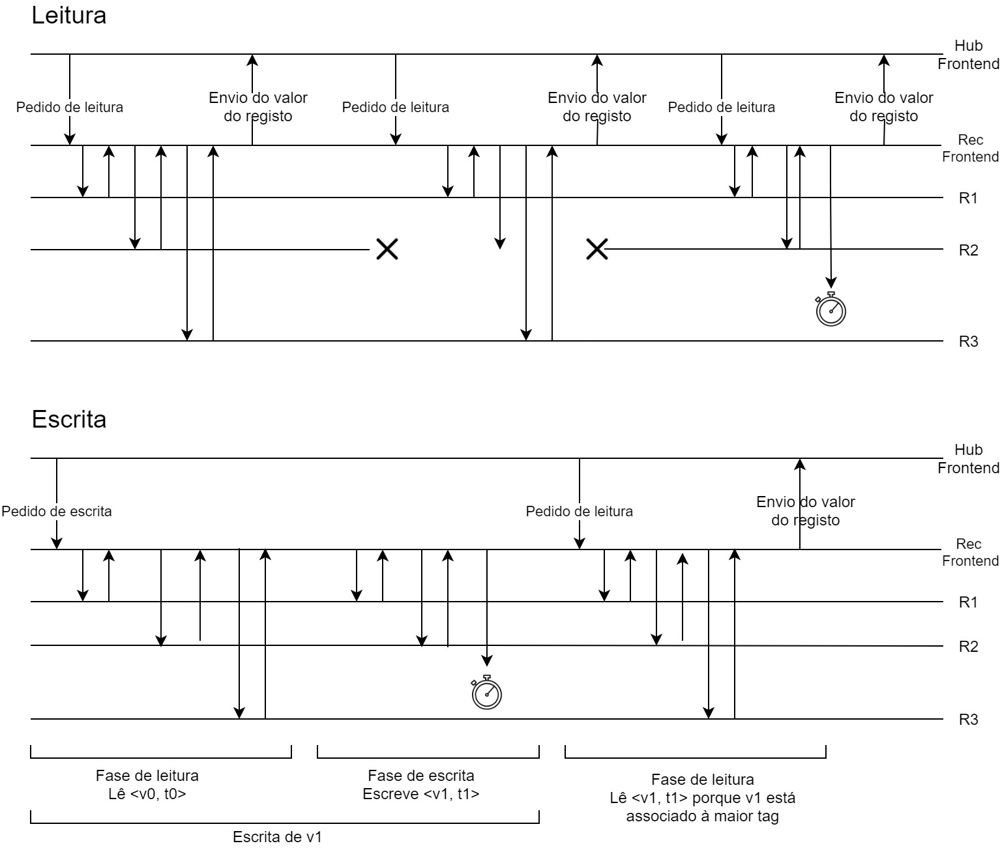
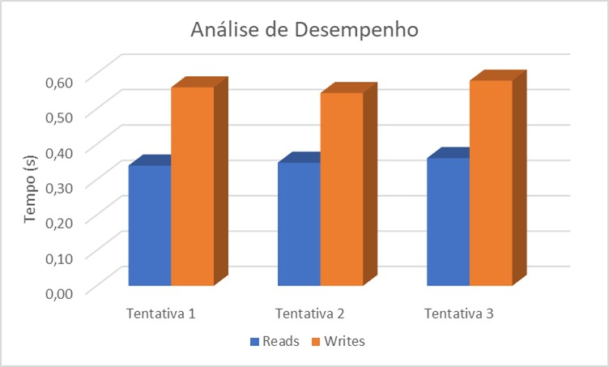
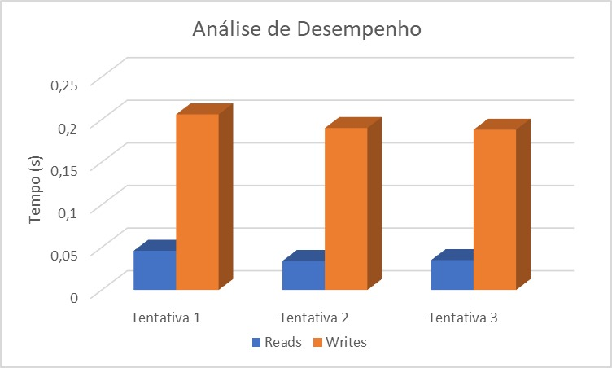

# Relatório do projeto *Bicloin*

Sistemas Distribuídos 2020-2021, segundo semestre

## Autores

**Grupo T01**

| Número | Nome              | Utilizador                                   | Correio eletrónico                  |
| -------|-------------------|----------------------------------------------| ------------------------------------|
| 93691  | Beatriz Alves | <https://git.rnl.tecnico.ulisboa.pt/ist193691> | <mailto:beatriz.cruz.alves@tecnico.ulisboa.pt>   |
| 93695  | Catarina Sousa       | <https://git.rnl.tecnico.ulisboa.pt/ist193695> | <mailto:catarinasousa2000@tecnico.ulisboa.pt>     |
| 93735  | Maria Ribeiro     | <https://git.rnl.tecnico.ulisboa.pt/ist193735> | <mailto:maria.f.ribeiro@tecnico.ulisboa.pt> |

 
  

## Melhorias da primeira parte

- [Correção das exceções do Rec](https://git.rnl.tecnico.ulisboa.pt/SD-20-21-2/T01-Bicloin/commit/afdee9104a2f83514d9bac117ebc9d273b65266e)
- [Verificação do número de argumentos nos comandos da App](https://git.rnl.tecnico.ulisboa.pt/SD-20-21-2/T01-Bicloin/commit/cb9af34b9adfa3c835bd5a9c1639dc6f5a74870e)
- [Compactação do comando help](https://git.rnl.tecnico.ulisboa.pt/SD-20-21-2/T01-Bicloin/commit/2d4cd8ef2330170f2de56c8b867995b59df0f367)
- [Melhoria das Mensagens de Exceção através de Enums](https://git.rnl.tecnico.ulisboa.pt/SD-20-21-2/T01-Bicloin/commit/2d4cd8ef2330170f2de56c8b867995b59df0f367)

## Modelo de faltas

Quando um Rec vai a baixo momentaneamente e depois se volta a ligar, as suas informações são atualizadas gradualmente, quando os outros Rec's fazem escritas. Quando isto acontece, apesar do Rec ir a baixo, a aplicação avisa que não consegue ligar-se ao Rec que está em falha, e continua a sua execução normal.

Se apenas existir uma réplica mais atualizada e se esta for abaixo, a nossa implementação não garante que estas informações passem para os restantes Rec's. 

Garantimos uma sincronização correta das escritas e leituras em todas as réplicas ativas, havendo portanto coesão de dados.

## Solução

UML do Modelo de Tolerância a Faltas:

Quando há um pedido de leitura por parte do cliente, é feito um pedido a cada réplica sendo retornado para o cliente o valor que está associado ao maior valor da Tag. Se existir um timeout durante este processo ou se uma réplica estiver em baixo (consequentemente existe um timeout), então a aplicação continua a funcionar e retorna o valor associado à maior Tag. 

Quando há um pedido de escrita, é repetido o processo de leitura previamente explicado para se obter o valor do registo mais atual. Após obtido este valor, todas as réplicas são atualizadas com o novo valor do registo e com a nova Tag. Se neste processo de escrita existir um timeout numa réplica, então esta réplica não é atualizada com o novo valor nem com a nova Tag. Posteriormente, se se fizer uma leitura é devolvido o valor mais atual. Se esta réplica que está em baixo regressar, então é atualizada quando existir uma nova escrita deste registo (valor e Tag são atualizados).

## Protocolo de replicação

Implementação de novas funcionalidades no Rec Frontend, que têm como função fazer as escritas e as leituras entre as réplicas, garantindo que cada leitura é feita da réplica com a informação mais atual, de modo a que exista uma maior coerência entre os dados.

Implementação de um Replica Manager que gere como são feitas as atualizações das restantes réplicas quando há uma escrita na réplica mais atualizada (réplica com a maior Tag). Para isto, implementámos uma função connect que permite à réplica conectar-se às restantes réplicas ativas. Posteriormente, atualizamos todas estas réplicas com o novo valor e a nova tag.

Seja uma escrita ou uma leitura, a primeira operação é feita pelo Rec Frontend, e tem como objetivo encontrar a réplica que tem a maior Tag referente aos dados nos quais se quer ler ou escrever, de modo a ler os valores mais recentes, que na escrita também é importante uma vez que algumas operações requerem verificações (por exemplo, num bike-up, verificar se o utilizador tem saldo suficiente). Caso seja uma leitura, o Rec Frontend lê o valor da réplica cuja Tag é a mais alta e devolve-o ao Hub que pediu este valor. No caso de uma escrita, o Rec Frontend garante que a escrita é feita no Rec mais atualizado, ou seja, com a maior Tag, e de seguida o Replica Manager atualiza apenas os valores atualizados pela escrita em todas as réplicas restantes.

## Medições de desempenho

Realizámos várias medições de desempenho da nossa aplicação e chegámos à conclusão que a nossa aplicação é bastante mais rápida quando se repete os mesmos comandos. Por exemplo, se efectuarmos 3 *balance*'s seguidos, que representam cada um uma leitura, o primeiro é muito mais lento e para demonstrar esta situação elaborámos dois gráficos diferentes. O mesmo acontece para os comandos que representam escritas.

Neste primeiro gráfico e tabela de desempenho, representamos os valores obtidos (tempos de leituras e escritas, em segundos) após a execução dos comandos logo ao iniciar a App:

|             | Reads   | Writes|
| ------------|---------|-------| 
| Tentativa 1 | 0.340   | 0.561 |
| Tentativa 2 | 0.348   | 0.545 |
| Tentativa 3 | 0.361   | 0.580 | 

Neste segundo gráfico e tabela de desempenho, representamos os valores obtidos (tempos de leituras e escritas, em segundos) após ter sido executado o comando uma vez no início, isto é, por exemplo, contabilizamos 3 reads do *balance* após termos feito um inicial, que não conta para esta estatística:

|             | Reads   | Writes|
| ------------|---------|-------| 
| Tentativa 1 | 0.046   | 0.206 |
| Tentativa 2 | 0.034   | 0.190 |
| Tentativa 3 | 0.035   | 0.188 | 

## Opções de implementação

Inicialmente, quando arrancamos o hub todas as réplicas são inicializadas com os valores contidos nos ficheiros users.csv e stations.csv. Para isto acontecer, obtemos os records que se encontram no serviço de nomes (Zookeeper) e através dos seus stubs inicializamos os valores (tal e qual como fazíamos na primeira entrega, porém, agora fazemos para todas as réplicas do Rec existentes).

Quando é efetuada uma escrita ou uma leitura, é escolhida a réplica com o valor associado à Tag mais atual. No caso de uma escrita, para além de existir uma leitura, é escolhida a mesma réplica para ser atualizada. Depois, através do Replica Manager, esta conecta-se às outras réplicas e atualiza-as.

Não implementámos nenhuma optimização, logo não é possível fazer comparações de desempenho entre o antes e o depois.

## Notas finais

Não tendo nada a acrescentar, damos o relatório por concluído.